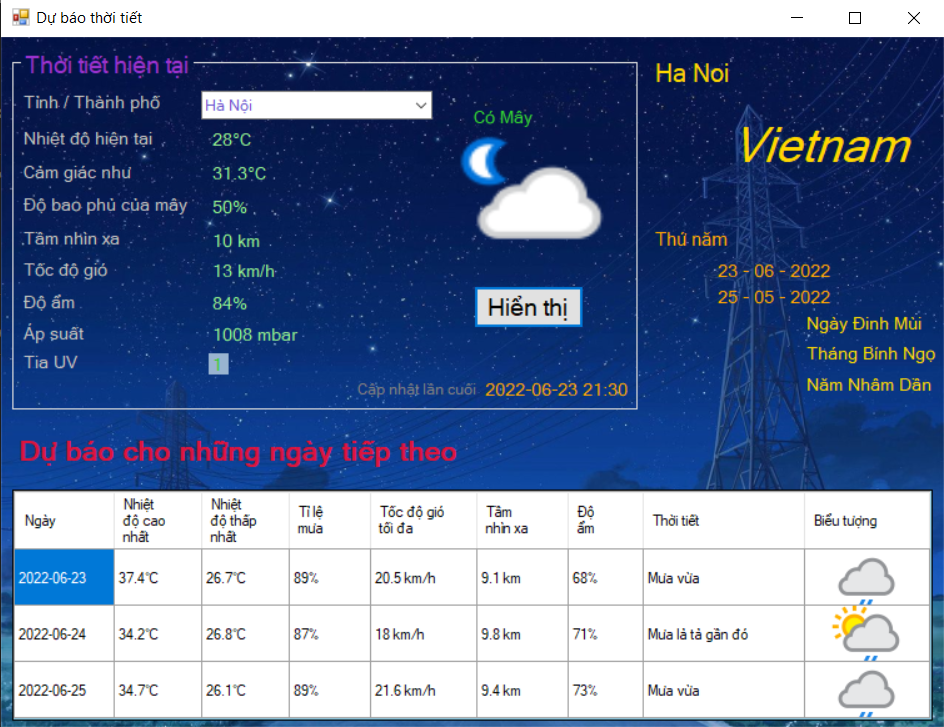
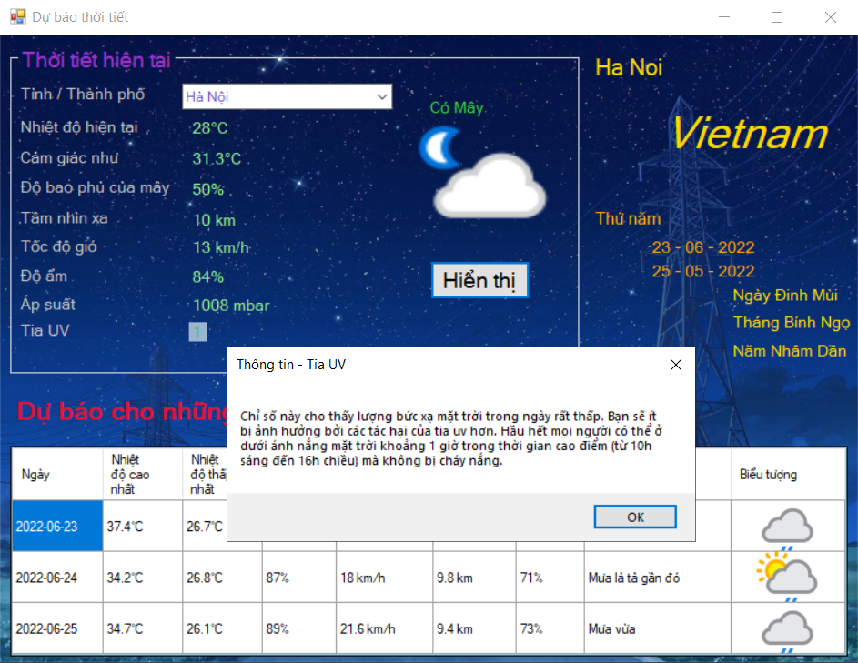
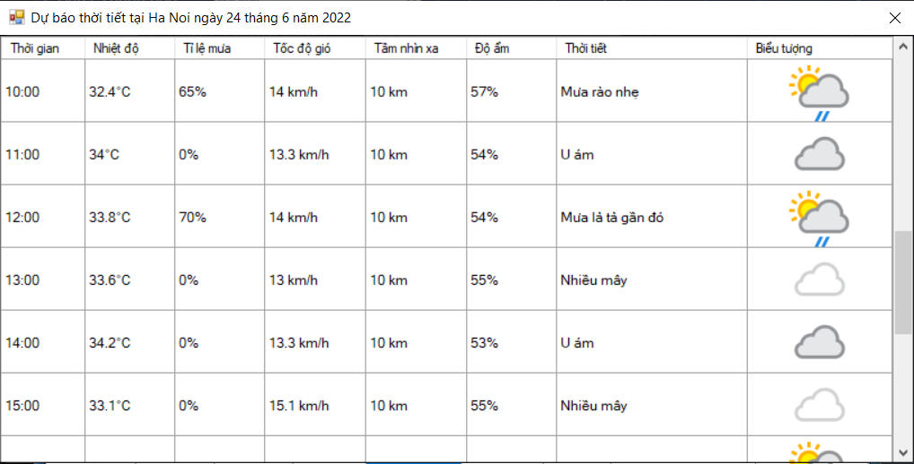
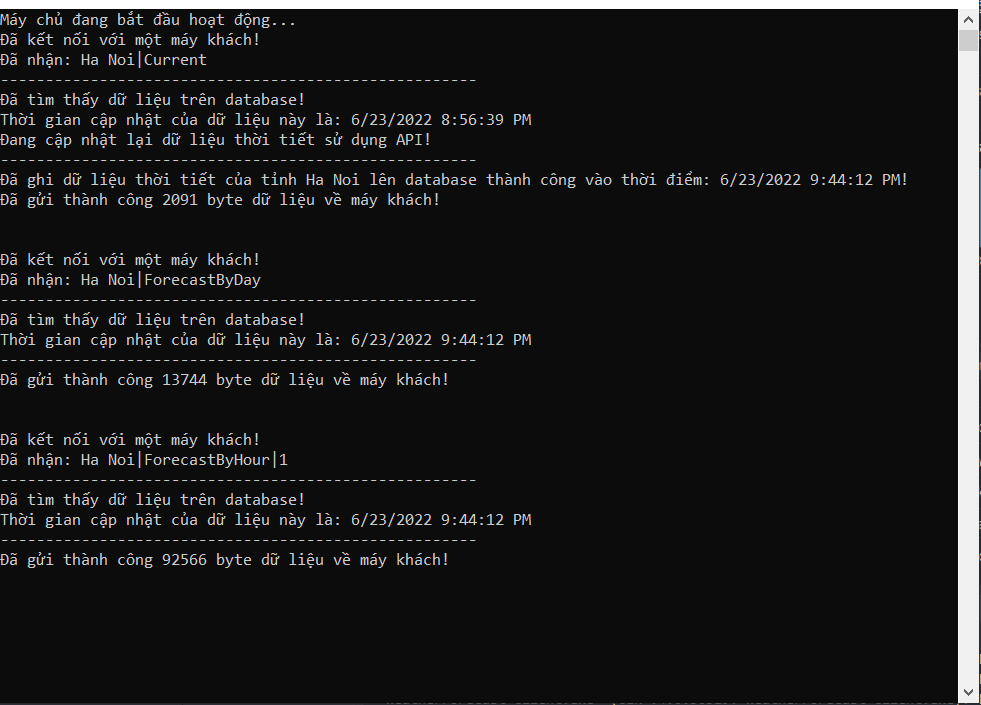

# Đồ án kết thúc môn học lập trình mạng.
## Ứng dụng dự báo thời tiết.
### Special thanks to WeatherAPI.com [Home page](https://www.weatherapi.com/) | [Github](https://github.com/weatherapicom)

# Các bước thiết lập ứng dụng.
#### B1. Clone code.
- Tạo một thư mục mới.
- Mở cmd và chuyển đến thư mục này.
- Chạy lệnh sau:
```sh
git clone https://github.com/ManhTuongNguyen/DuBaoThoiTiet.git
```

#### B2. Lấy key để sử dụng API.
- Truy cập trang web https://www.weatherapi.com/
- Đăng ký một tài khoản và đăng nhập bằng tài khoản vừa đăng ký.
- Tại mục Dashboards, copy ```API Key```.
- Chỉnh sửa API Key của bạn tại biến ```key``` trong ```WeatherForecast_Server\WeatherForecastServerHelper.cs```

#### B3. Thiết lập cơ sở dữ liệu.
**Lưu ý: Có thể bỏ qua bước này mà ứng dụng vẫn hoạt động bình thường.<br>
Thiết lập cơ sở dữ liệu để làm cache cho server, tránh request API quá nhiều lần gây lãng phí tài nguyên.**
- Mở SQL Server Managerment Studio
- Tạo một query mới (Ctrl + N)
- Copy query từ file ```SQLQuery_WeatherForecast.sql```
- Chạy query (F5)
- Thay đổi chuỗi kết nối đến cơ sở dữ liệu của bạn tại biến ```connectionString``` trong ```WeatherForecast_Server\DataProvider.cs```

# Các bước sử dụng ứng dụng.
#### B1. Mở ứng dụng.
- Tại thư mục clone code, double click chuột vào file ```WeatherForecast.sln```
#### B2. Mở client.
- Trong Visual Studio, nhấn start để chạy chương trình
#### B3. Mở server.
- Mở cửa sổ ```Solution Explorer``` trong *Visual Studio*
- Click chuột phải vào project ```WeatherForecast_Server```
- Chọn ```Debug``` -> ```Start New Instance```

Sau khi hoàn thành các bước trên, ta có thể tìm thông tin dự báo thời tiết bằng client.

### Screenshot




